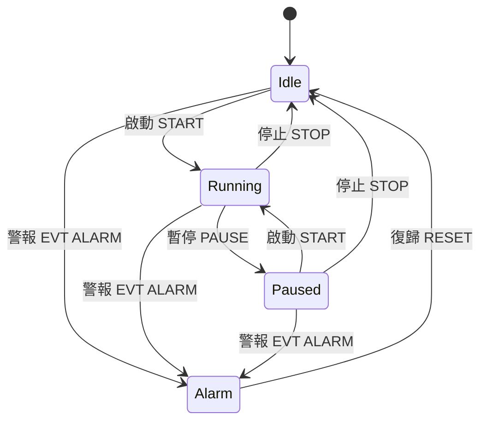

# 機台狀態機

作者：linyuhang617 · Slice 3

## 狀態圖

## 狀態

| 狀態 | 中文 | 燈號（Slice 5） | 允許的操作 |
| --- | --- | --- | --- |
| Idle | 待機 | 無 | 啟動 |
| Running | 運轉 | 綠 | 暫停、停止 |
| Paused | 暫停 | 黃 | 啟動（繼續）、停止 |
| Alarm | 警報 | 紅 | 復歸 |

警報不是操作員能按的按鈕，只能由機台主動事件 `EVT ALARM <代碼>` 觸發，從待機、運轉、暫停都會進入警報。
測試時可在「指令」欄送出 `ALARM`，或在模擬機台視窗按 A 鍵，讓模擬機台發出警報。

## 轉換表

規則集中寫在 `MachineStateMachine` 的一張表裡，不在表上的組合一律是非法轉換。

| 目前狀態 | 觸發 | 下一個狀態 |
| --- | --- | --- |
| Idle | Start | Running |
| Running | Pause | Paused |
| Paused | Start | Running |
| Running | Stop | Idle |
| Paused | Stop | Idle |
| Idle | Alarm | Alarm |
| Running | Alarm | Alarm |
| Paused | Alarm | Alarm |
| Alarm | Reset | Idle |

## 非法操作的三道防線

1. **畫面**：只有目前狀態允許的按鈕可以按，例如待機時「暫停」是灰的。
2. **主控端狀態機**：`MachineController.ExecuteAsync` 先檢查，非法就拒絕並記錄，不送給機台。
3. **機台本身**：模擬機台也有同樣的規則，收到不允許的指令回 `ERR INVALID_STATE <目前狀態>`。
   可在「指令」欄手動送出 `PAUSE` 測試。

## 狀態以機台為準

- 送出指令後，機台回 `OK` 才轉換狀態；回 `ERR` 或逾時則狀態不變。
- 連線或重連成功後，用 `GET STATUS` 查詢機台實際狀態並同步，因為斷線期間機台可能已經改變（例如發生警報）。
- 機台主動事件（`EVT` 開頭）永遠不會被當成指令的回應，即使剛好有指令在等。

## 單元測試

- `MachineStateMachineTests`：9 個合法轉換、11 個非法轉換各一個案例，另有事件、允許操作清單、同步的測試。
- `MachineControllerTests`：合法操作、非法拒絕、機台回錯誤、逾時、完整流程、警報、復歸、同步、狀態解析。
